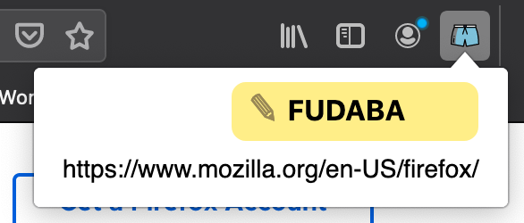

# UrlToPaper 

### A personal URL shortener

Managing your personal log or TODO list on an actual notebook, using paper, is probably one of the best options you have. However, you cannot have clickable URLs in paper!!

What about having a button on the browser that gives you a simple, short code like "YUCUMO" that you can write on your notebook, and that you can later enter to access to the original URL?

That is what this extension aims to do. It manages a personal URL shortener you can take note of, and that synchronises across all the browsers you are logged in.

